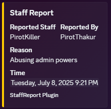
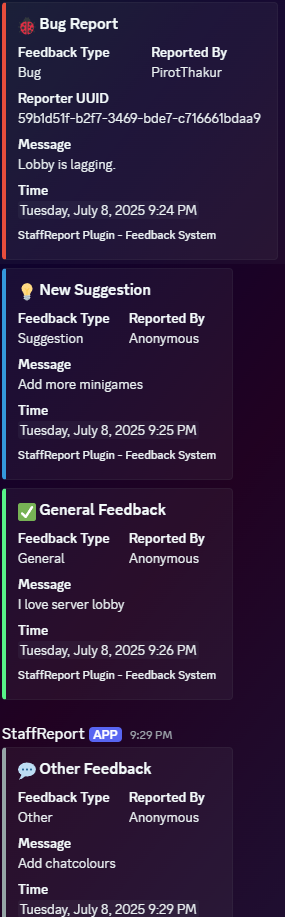

# ✨ StaffLink: Bridging Reports & Feedback to Discord 🔗

**StaffLink** is your go-to Minecraft plugin for fostering better communication, transparency, and accountability! 🗣️ Empower your players with easy-to-use in-game commands to report staff misconduct 👮 and submit valuable, categorized feedback 📝, with all messages instantly relayed to your Discord server 💬 via webhooks. Streamline your moderation 🛠️ and build a more responsive community today!

---

## Key Features:

* ### `/reportstaff <staff_member_name> <reason>`: 🚨 Report staff misconduct directly from the game!
    * **Aliases:** `/rs`
    * Sends instant alerts to your designated Discord channel via webhook 🔔 (requires configuration in the plugin's `config.yml`).
    * **Permission (`stafflink.report`):** 🔒 Optionally control who can use this command.
        * Players without this permission will receive the message: `"🚫 You do not have permission to report staff."`

* ### `/feedback <type> [anonymous] <message>`: 📝 Submit categorized feedback, suggestions, or bug reports!
    * **Aliases:** `/f`
    * **Feedback Types:** Players can specify the type of feedback they are submitting, allowing for better organization:
        * `suggestion`
        * `bug` 🐛
        * `general`
        * `other`
    * **🤫 Anonymous Option:** Players can choose to send feedback anonymously by including `anonymous` in the command, protecting their identity while still providing valuable input.
        * **Example Usage:**
            * `/feedback suggestion Add more minigames!` ✨
            * `/feedback bug anonymous Lobby is lagging. 🐌`
    * All feedback messages are automatically forwarded to a specified Discord webhook 📬.
    * **Permission (`stafflink.feedback`):** ✅ Manage who is allowed to send feedback.
        * Unauthorized players will see: `"🚫 You do not have permission to send feedback."`

* ### Discord Webhook Integration: 🌐
  Seamlessly sends all staff reports and player feedback (including type and anonymity status) to your Discord 💬 for organized tracking, discussion, and efficient action by your administrative and moderation teams.

* ### 🚀 Lightweight & Efficient:
  Designed for optimal performance, ensuring minimal impact on your server's resources and keeping your gameplay smooth.

---

## Why Choose StaffLink?

* ✅ **Enhance Staff Accountability**: Provide a clear, accessible, and straightforward reporting mechanism for players, helping to ensure your staff members uphold high standards of conduct and professionalism.
* 🗣️ **Boost Player Engagement**: Demonstrate that player voices are valued by offering a direct and versatile feedback system, fostering a more involved and loyal community.
* 🛠️ **Streamline Communication**: Centralize all reports and feedback within your Discord server, significantly improving the efficiency of your moderation and community management workflows.
* ❤️ **Improve Server Environment**: Quickly identify and address issues, resolve conflicts, and gather invaluable insights to continuously make your server a better and more enjoyable place for all players.

---

## Technical Details:

* **Plugin Name:** `StaffLink`
* **Version:** `1.0` 🚀
* **Supported/Tested Version:** `1.21.x`, ` 1.20.x`, ` 1.19.x` 🚀
* **API-Version:** `1.21` (Ensures compatibility and stability for modern Minecraft server environments.)
* **Authors:** `PirotKiller`

---

Integrate **StaffLink** into your Minecraft server today and cultivate a more responsive, accountable, and transparent community! 🎉


# Configuration: `config.yml`

The `config.yml` file is automatically generated upon the first run of the StaffLink plugin. This file allows server administrators to customize the plugin's behavior, connect to Discord, and manage the list of reportable staff members.

## Example `config.yml`:

```yaml
# StaffLink Configuration

# Permissions:
# These are the permission nodes you can use with your permission plugin (e.g., LuckPerms).
# - stafflink.report  - Allows players to use the /reportstaff command.
# - stafflink.feedback - Allows players to use the /feedback command.

# Discord Webhook URL for Staff Reports:
# This is the URL where all messages generated by the /reportstaff command will be sent.
# To get a webhook URL:
#   1. Go to your Discord Server Settings.
#   2. Navigate to "Integrations" -> "Webhooks".
#   3. Click "New Webhook" or edit an existing one.
#   4. Copy the "Webhook URL" and paste it below.
discord-report-webhook-url: "YOUR_DISCORD_WEBHOOK_URL_HERE" # Replace this with your actual webhook URL

# Discord Webhook URL for Player Feedback:
# This is the URL where all messages generated by the /feedback command will be sent.
# You can use the same webhook URL as for reports, or a different one for better organization (e.g.,
# sending feedback to a specific #feedback channel and reports to a #moderation-logs channel).
discord-feedback-webhook-url: "YOUR_DISCORD_WEBHOOK_URL_FOR_FEEDBACK" # Replace this with your actual webhook URL

# List of Staff Members:
# This list specifies the in-game names of your staff members who can be reported using the /reportstaff command.
# Only players whose names are present in this list will be valid targets for reports.
# Ensure names are exact (case-sensitive) as they appear in Minecraft.
Staff-Member:
  - "Staff1" # Example: Staff member one.
  - "Staff2" # Example: Staff member two.
  - "null"        # Not Important can be removed.
```

## Discord Webhook Integration Examples:

StaffLink seamlessly sends reports and feedback directly to your Discord server via webhooks. Here are some examples of how these messages appear in Discord:

### Staff Report:


_Example of a Staff Report message sent to Discord._

---

### Player Feedback:

StaffLink categorizes feedback based on the `/feedback` command usage, and you can even send it anonymously.


_Example of various Player Feedback messages (Bug, Suggestion, General, Other) sent to Discord._

---

These images demonstrate how StaffLink provides clear and informative messages directly to your Discord server, making moderation and community feedback management easier.